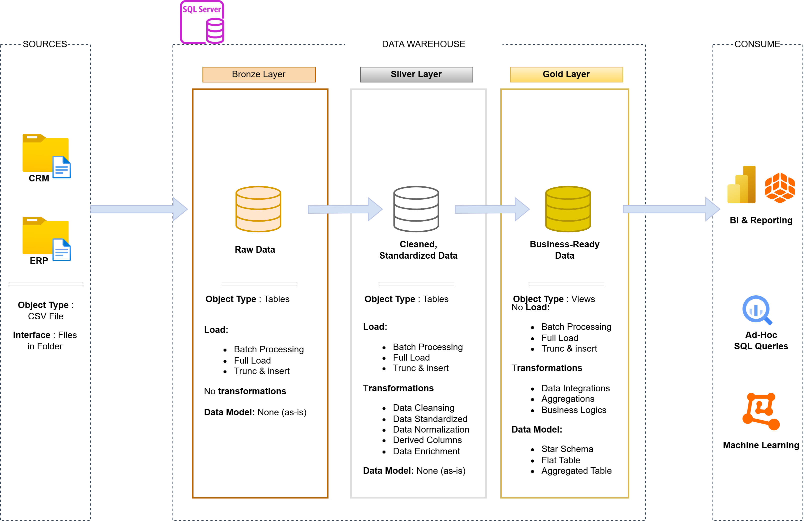

# Projet d'Entrepôt de Données et d'Analytique

Bienvenue dans le dépôt du **Projet d'Entrepôt de Données et d'Analytique** ! 🚀  
Ce projet présente une solution complète d'entreposage de données et d'analytique, de la construction d'un entrepôt de données jusqu'à la production d'informations exploitables. Conçu comme un projet de portfolio, il met en avant les meilleures pratiques du secteur en ingénierie des données et en analytique.

---

## 🏗️ Architecture des Données

L'architecture des données de ce projet suit l'architecture Médaillon avec les couches **Bronze**, **Silver** et **Gold** :

1. **Couche Bronze** : Stocke les données brutes telles quelles depuis les systèmes sources. Les données sont ingérées à partir de fichiers CSV dans une base de données SQL Server.
2. **Couche Silver** : Cette couche comprend les processus de nettoyage, de standardisation et de normalisation des données afin de les préparer pour l'analyse.
3. **Couche Gold** : Héberge les données prêtes pour le métier, modélisées en schéma en étoile, nécessaires au reporting et à l'analytique.

---

## 📖 Aperçu du Projet

Ce projet comprend :

1. **Architecture des Données** : Conception d'un entrepôt de données moderne selon l'architecture Médaillon avec les couches **Bronze**, **Silver** et **Gold**.
2. **Pipelines ETL** : Extraction, transformation et chargement des données depuis les systèmes sources vers l'entrepôt.
3. **Modélisation des Données** : Développement de tables de faits et de dimensions optimisées pour les requêtes analytiques.
4. **Analytique & Reporting** : Création de rapports et de tableaux de bord basés sur SQL pour obtenir des informations exploitables.

🎯 Ce dépôt est une excellente ressource pour les professionnels et les étudiants souhaitant démontrer leur expertise en :

- Développement SQL
- Architecture de Données
- Ingénierie des Données
- Développement de Pipelines ETL
- Modélisation des Données
- Analyse de Données

---

## 🚀 Exigences du Projet

### Construction de l'Entrepôt de Données (Ingénierie des Données)

#### Objectif

Développer un entrepôt de données moderne avec SQL Server afin de consolider les données de ventes, permettant le reporting analytique et une prise de décision éclairée.

#### Spécifications

- **Sources de Données** : Importer les données de deux systèmes sources (ERP et CRM) fournies sous forme de fichiers CSV.
- **Qualité des Données** : Nettoyer et résoudre les problèmes de qualité des données avant l'analyse.
- **Intégration** : Combiner les deux sources en un modèle de données unique et convivial, conçu pour les requêtes analytiques.
- **Périmètre** : Se concentrer uniquement sur le jeu de données le plus récent ; l'historisation des données n'est pas requise.
- **Documentation** : Fournir une documentation claire du modèle de données pour accompagner à la fois les parties prenantes métier et les équipes d'analytique.

---

### BI : Analytique & Reporting (Analyse de Données)

#### Objectif

Développer des analyses basées sur SQL pour fournir des informations détaillées sur :

- **Le Comportement des Clients**
- **La Performance des Produits**
- **Les Tendances des Ventes**

Ces informations fournissent aux parties prenantes des indicateurs métier clés, permettant une prise de décision stratégique.
